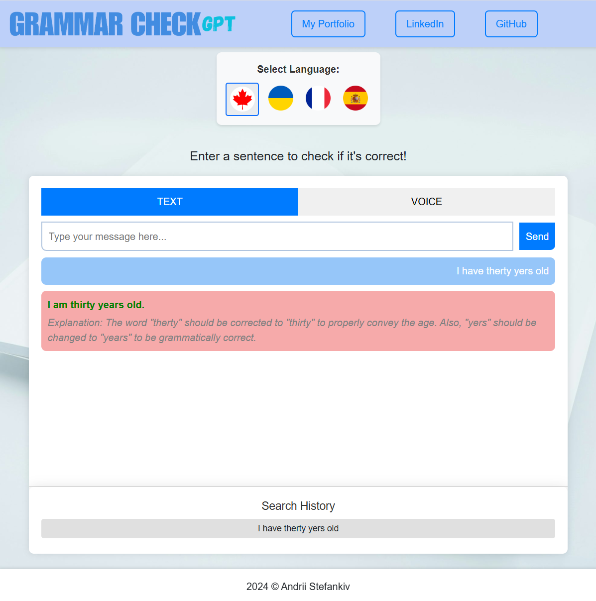
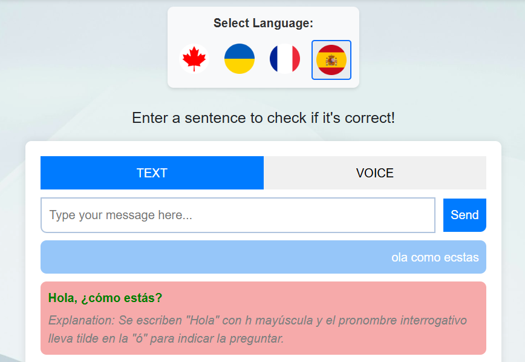

# Chatgpt-Grammar
[Click](https://gptgrammar.netlify.app/)

A chat gpt api-powered web application designed to correct your English sentences, analyze mistakes, and offer detailed explanations.

You can enter an English sentence either by typing or using voice input. Once submitted, the app will provide a thorough analysis of any errors and a detailed explanation of the mistakes to help you improve your English.

## Typing

## Switching languages

## Voice input
